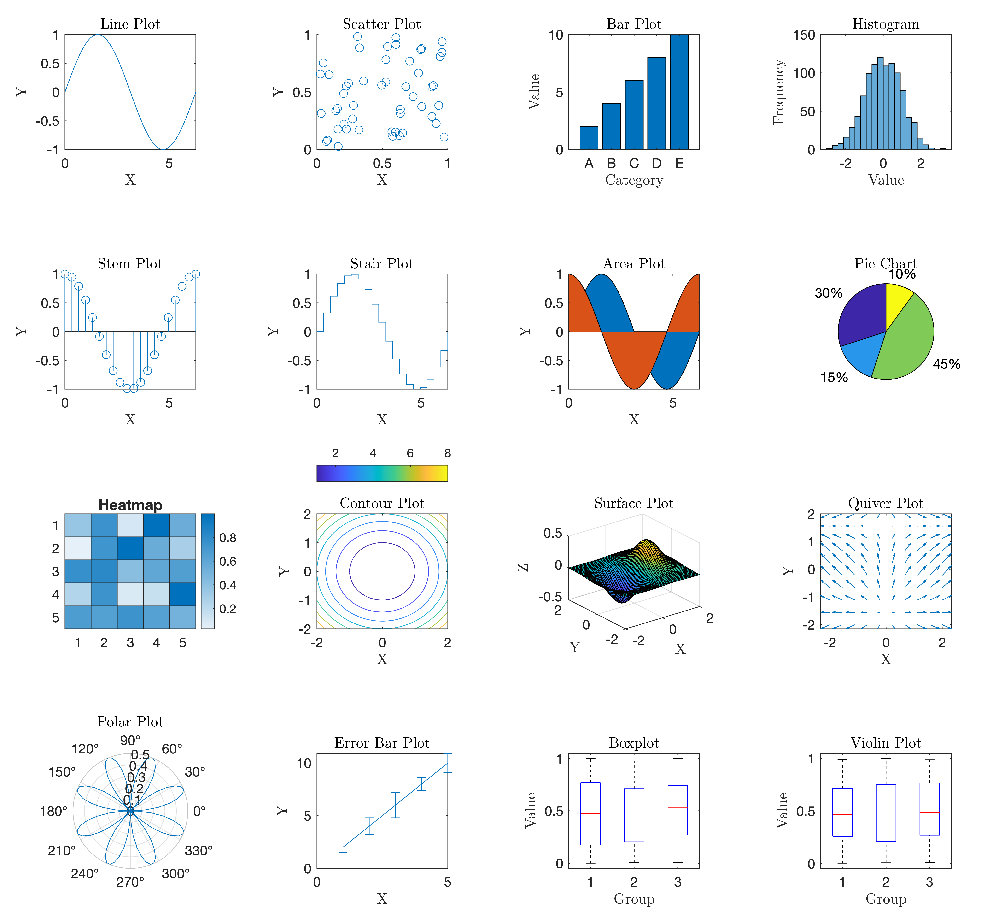

function Nplot_figure_tiledlayout(figureHandle, numPlotsPerRow, numRows, varargin) A versatile function for creating publication-quality figures with multiple plots

I often found myself spending countless hours trying to create figures that met the strict formatting guidelines of various scientific journals. It was a tedious and time-consuming process, especially when dealing with multiple plots within a single figure. That's when I decided to take matters into my own hands and develop a MATLAB function that would streamline the figure preparation process, specifically tailored to the requirements of journals.

One of the **key** features I incorporated was the ability to accommodate a top colorbar, seamlessly integrated into the figure layout. This addition proved to be invaluable for many research projects, allowing for clear and concise representation of data without affecting the **aspect ratio** of the figure.

Feel free to explore the capabilities of the function, open issues, and share ideas, customize it to suit your specific needs.

## Example

This example demonstrates how to create a figure with multiple subplots using the `Nplot_figure_tiledlayout` function and MATLAB's `tiledlayout` function.

